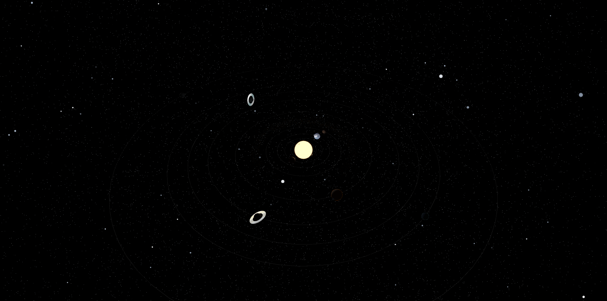

# Solar System using Three.js 

# Description

An interactive 3D Solar System simulation built using THREE.js and JavaScript. Users are able to view the planets orbiting the sun in real time, with approxmimate scaling of planet sizes, speeds (rotational and orbital) and hierarchical motion of moons. The project demonstrates real-time animation, hierarchical transformations, vector math, and efficient rendering of thousands of asteroids in a browser environment.

Includes individual renderings of each celestial body, excluding the asteroid belt. Users can view each planet up close and toggle its size and orbital speed.

# Features

- **Real-time 3D animation:** planets, moons, and asteroid belts move continuously using requestAnimationFrame.

- **Hierarchical transformations:** the Moon orbits Earth, automatically inheriting Earth’s movement.

- **Planetary orbits:** each planet moves along a circular orbit around the Sun with unique radius and speed.

- **Asteroid belts:** thousands of asteroids rendered efficiently using InstancedMesh, each with random orbit, rotation, and color.

- **Interactive controls:** rotate, pan, and zoom the scene with OrbitControls.

- **Dynamic lighting:** the Sun is a PointLight illuminating all planets and objects.

- **Modular code structure:** each celestial body is defined in a separate file for maintainability.
- **Explore individual celestial bodies:** Each planet and moon can be isolated for detailed viewing, with adjustable size and orbital speed for experimentation.

# Demo

# Tech Stack

- JavaScript

- Three.js

- HTML / CSS

- WebGL (via Three.js)

# Algorithm / Technical Details

- **Planet and Moon Motion:** Positions are updated using trigonometric functions (cos and sin) to simulate circular orbits.

- **Animation Loop:** requestAnimationFrame continuously updates object positions and renders the scene.

- **Hierarchical Motion:** Moon is added as a child of the Earth group, so it automatically orbits with Earth.

- **Asteroid Belts:** Each asteroid has its own orbit angle, speed, vertical offset and colour, updated every frame for dynamic movement.

# Credits / Resources

- Planet textures and images were sourced from [JHT's Planet Pixel Emporium](https://planetpixelemporium.com)

- Planet textures can also be sourced from [NASA Solar System Textures](https://www.solarsystemscope.com/textures/)

- Starfield and Fresnel mapping were implemented following [Robot Bobby](https://www.youtube.com/@robotbobby9)

***All other code and implementation is original.***

# Notes

- This project was completed as part of my personal portfolio.

- Source code is clean, modular, and well-commented for learning purposes.

***Files with just planet names are individual renderings, those that end in "expo" are used within the Solar System rendering.***

